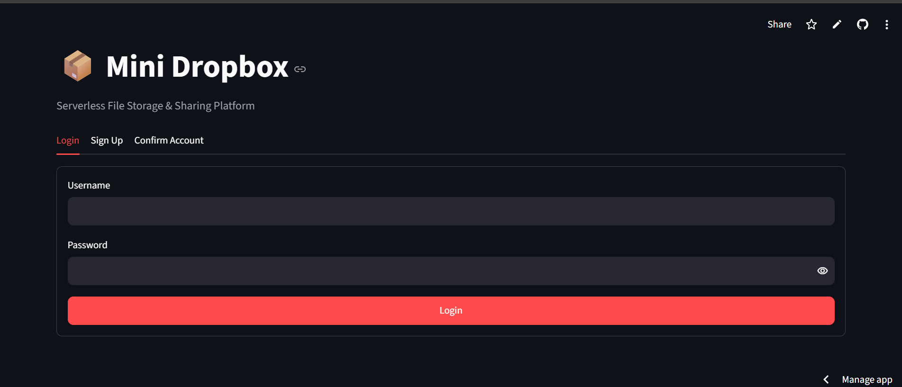
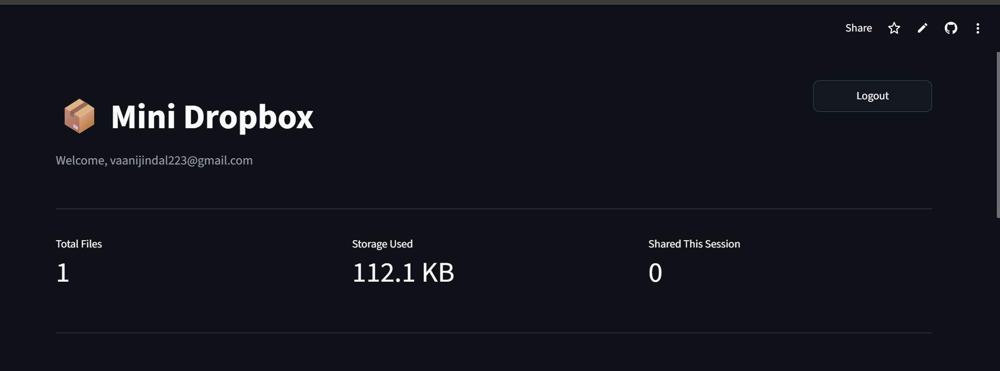
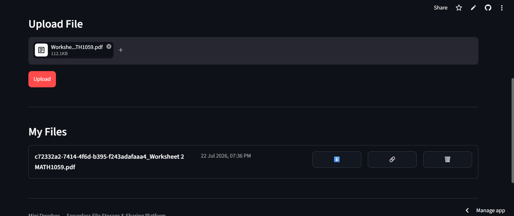

# 🗂️ Serverless Mini Dropbox – Secure File Storage & Sharing Platform

A scalable, serverless cloud storage platform built entirely on AWS. It enables secure file upload, download, sharing, metadata management, and user authentication — with a Python frontend deployed on Streamlit and a fully serverless AWS backend.

🔗 **Live App:** [[Streamlit app deployment link here](https://vaanijindal223-a-serverless-document-comppre-frontendapp-iwjldg.streamlit.app/)]

---

## 🚀 Features

- 🔐 **User Authentication** — Sign up, log in, and session management via Amazon Cognito
- 📤 **File Upload** — Securely upload files to Amazon S3
- 📥 **File Download** — Retrieve stored files on demand
- 🔗 **File Sharing** — Generate shareable links/access for uploaded files
- 🏷️ **Metadata Management** — Track file name, size, owner, upload date, etc. via DynamoDB
- 📊 **Dashboard** — View and manage all uploaded files in one place
- 📈 **CloudWatch Monitoring** — Logs and metrics for backend Lambda functions
- 🔔 **Notifications** — Event-driven alerts via SNS (e.g., upload/share events)

---

## 📸 Screenshots

### Login / Authentication


### Dashboard


### File Upload


### File Sharing


> Save your screenshots inside `docs/screenshots/` and update the file names/paths above to match. PNG or JPG both work — keep each image under ~1–2 MB so the README loads quickly on GitHub.

---

## 🏗️ Architecture

```
User → Streamlit Frontend → API Gateway → AWS Lambda (business logic)
                                              ├── Amazon Cognito (Auth)
                                              ├── Amazon S3 (File Storage)
                                              ├── Amazon DynamoDB (Metadata)
                                              ├── Amazon SNS (Notifications)
                                              └── Amazon CloudWatch (Monitoring/Logs)
                        ↓
                  Amazon CloudFront (Content Delivery)
```

**Flow:**
1. User authenticates through **Amazon Cognito**.
2. Frontend calls backend endpoints exposed via **API Gateway**.
3. **Lambda functions** handle upload/download/share/metadata requests.
4. Files are stored in **S3**; file metadata (owner, size, timestamps, share status) is stored in **DynamoDB**.
5. **CloudFront** accelerates content delivery for downloads/shares.
6. **SNS** sends notifications on key events (e.g., successful upload, file shared).
7. **CloudWatch** logs and monitors all Lambda executions for debugging and performance tracking.
8. **IAM** roles/policies enforce least-privilege access between all services.

---

## 🛠️ Tech Stack

| Layer                    | Technology              |
|---------------------------|---------------------------|
| Frontend                  | Streamlit (Python)        |
| Compute (Backend Logic)   | AWS Lambda                |
| API Layer                 | Amazon API Gateway        |
| Authentication             | Amazon Cognito             |
| File Storage                | Amazon S3                  |
| Metadata Store                | Amazon DynamoDB             |
| Content Delivery                | Amazon CloudFront            |
| Notifications                     | Amazon SNS                    |
| Monitoring & Logging                 | Amazon CloudWatch              |
| Access Control                          | AWS IAM                          |

---

## 📂 Project Structure

```
├── frontend/                # Streamlit application
│   ├── app.py                # Main entry point
│   ├── pages/                # Dashboard, upload, share, login pages
│   └── requirements.txt      # Frontend dependencies
│
├── backend/                 # AWS Lambda functions & backend logic
│   ├── upload/                # Upload handler
│   ├── download/               # Download handler
│   ├── share/                   # File sharing handler
│   ├── metadata/                 # DynamoDB metadata handler
│   └── auth/                      # Cognito auth helpers
│
├── docs/                    # Architecture diagrams & project documentation
│   └── screenshots/          # App screenshots used in README
│
├── .streamlit/               # Streamlit configuration (theme, secrets template)
│   └── config.toml
│
├── .venv/                    # Local virtual environment (not committed)
├── .gitignore
└── README.md
```

> Update this tree if your actual file/folder names differ — this reflects the structure implied by your `frontend/` and `backend/` split.

---

## ⚙️ Setup & Installation (Local)

### 1. Clone the repository
```bash
git clone https://github.com/<your-username>/<your-repo-name>.git
cd <your-repo-name>
```

### 2. Create a virtual environment
```bash
python -m venv .venv
source .venv/bin/activate   # On Windows: .venv\Scripts\activate
```

### 3. Install dependencies
```bash
pip install -r frontend/requirements.txt
```

### 4. Configure environment variables / secrets

Create a `.env` file (or `.streamlit/secrets.toml`) with your AWS resource details:

```
AWS_ACCESS_KEY_ID=your_access_key
AWS_SECRET_ACCESS_KEY=your_secret_key
AWS_REGION=your_region

COGNITO_USER_POOL_ID=your_user_pool_id
COGNITO_APP_CLIENT_ID=your_app_client_id

S3_BUCKET_NAME=your_bucket_name
DYNAMODB_TABLE_NAME=your_table_name
API_GATEWAY_URL=your_api_gateway_endpoint
SNS_TOPIC_ARN=your_sns_topic_arn
```

### 5. Run the app locally
```bash
streamlit run frontend/app.py
```

---

## ☁️ Backend Deployment (AWS)

1. Package and deploy each Lambda function under `backend/` (e.g., using AWS SAM, Serverless Framework, or the AWS Console/CLI).
2. Configure **API Gateway** routes to trigger the corresponding Lambda functions (upload, download, share, metadata, auth).
3. Set up **Amazon Cognito** User Pool and App Client for authentication.
4. Create the **S3 bucket** for file storage and the **DynamoDB table** for metadata.
5. Configure **CloudFront** distribution in front of S3/API Gateway for faster content delivery.
6. Set up **SNS** topics for upload/share event notifications.
7. Enable **CloudWatch** logging for all Lambda functions.
8. Attach least-privilege **IAM roles** to each Lambda function.

---

## 🖥️ Frontend Deployment (Streamlit Community Cloud)

1. Push your code to a public GitHub repository.
2. Go to [share.streamlit.io](https://share.streamlit.io) and connect your repo.
3. Set the main file path to `frontend/app.py`.
4. Add your AWS/Cognito credentials under **App Settings → Secrets**:
```toml
   AWS_ACCESS_KEY_ID = "your_access_key"
   AWS_SECRET_ACCESS_KEY = "your_secret_key"
   AWS_REGION = "your_region"
   COGNITO_USER_POOL_ID = "your_user_pool_id"
   COGNITO_APP_CLIENT_ID = "your_app_client_id"
   S3_BUCKET_NAME = "your_bucket_name"
   DYNAMODB_TABLE_NAME = "your_table_name"
   API_GATEWAY_URL = "your_api_gateway_endpoint"
```
5. Deploy — Streamlit will build and host the app automatically.

---

## 🔒 Environment Variables Reference

| Variable                  | Description                              |
|-----------------------------|---------------------------------------------|
| `AWS_ACCESS_KEY_ID`         | AWS IAM access key                          |
| `AWS_SECRET_ACCESS_KEY`     | AWS IAM secret key                          |
| `AWS_REGION`                | AWS region (e.g., `ap-south-1`)             |
| `COGNITO_USER_POOL_ID`      | Cognito User Pool ID for authentication     |
| `COGNITO_APP_CLIENT_ID`     | Cognito App Client ID                       |
| `S3_BUCKET_NAME`            | S3 bucket used for file storage             |
| `DYNAMODB_TABLE_NAME`       | DynamoDB table used for file metadata       |
| `API_GATEWAY_URL`           | Base URL for the deployed API Gateway       |
| `SNS_TOPIC_ARN`             | SNS topic ARN for event notifications       |

---

## 🧪 Future Improvements

- Folder-based file organization
- File versioning support
- Granular sharing permissions (view-only, expiry links)
- Multi-file batch upload/download
- Usage analytics on the dashboard

---

## 👤 Author

**[Your Name]**
- GitHub: [@your-username](https://github.com/your-username)
- LinkedIn: [Your LinkedIn](https://linkedin.com)

---

## 📄 License

This project is licensed under the MIT License — see the [LICENSE](LICENSE) file for details.
